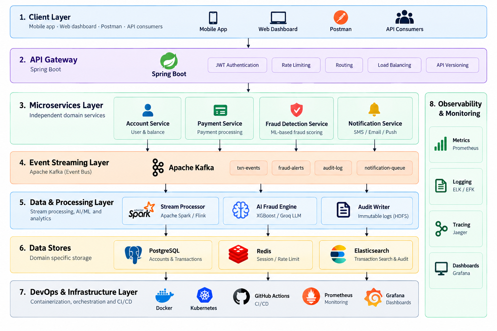
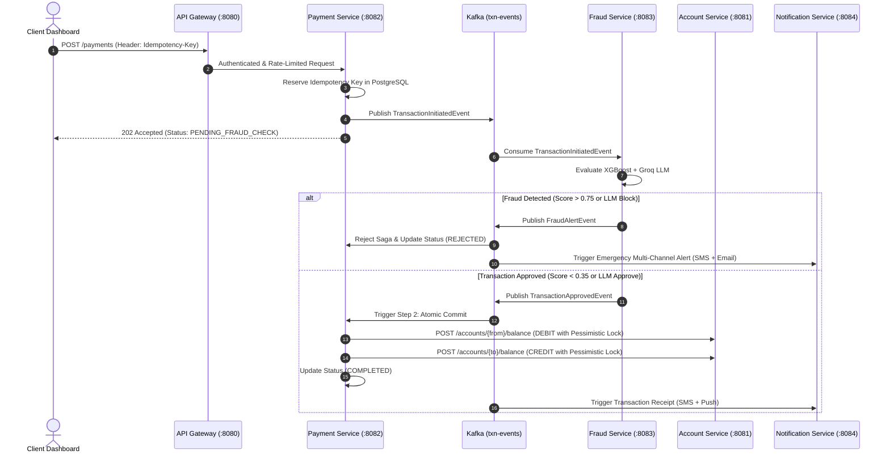

# ⚡ Bankflow — Enterprise Distributed Banking & AI Fraud Platform

[](https://github.com/Sanju562586/bankflow/actions)
[](https://www.oracle.com/java/)
[](https://spring.io/projects/spring-boot)
[](https://spring.io/projects/spring-cloud)
[](https://kafka.apache.org/)
[](https://www.postgresql.org/)
[](https://redis.io/)
[](https://xgboost.ai/)
[](https://groq.com/)
[](https://kubernetes.io/)
[](https://opensource.org/licenses/MIT)

> **Bankflow** is an enterprise-grade, event-driven distributed banking and payment orchestration platform designed for high throughput, sub-20ms fraud inference, and zero financial inconsistencies. It implements the Saga distributed transaction pattern, strict database-level idempotency enforcement, hybrid AI fraud evaluation (SMOTE-calibrated XGBoost + Groq LLM natural-language reasoning), multi-channel alerting with exponential backoff retries, and comprehensive full-stack observability.

---

## 🏛 System Architecture & High-Level Design



```
                                  +-------------------------------------------------------------+
                                  |                         Client Tier                         |
                                  |   Mobile App  ·  Web Dashboard (:3000)  ·  API Consumers    |
                                  +------------------------------+------------------------------+
                                                                 |
                                                                 v
                                  +-------------------------------------------------------------+
                                  |                  API Gateway (Spring Cloud)                 |
                                  |  · Port 8080                                                |
                                  |  · JWT Authentication (HMAC-SHA256)                         |
                                  |  · Role-Based Authorization (CUSTOMER, ADMIN, OPERATOR)     |
                                  |  · Redis Token Bucket Rate Limiter (20 req/s, burst 40)     |
                                  +------------------------------+------------------------------+
                                                                 |
                 +------------------------+----------------------+-----------------------+------------------------+
                 |                        |                                              |                        |
                 v                        v                                              v                        v
     +-----------------------+  +-------------------+                          +--------------------+  +--------------------+
     |    Account Service    |  |  Payment Service  |                          |  Fraud Detection   |  |Notification Service|
     |  · Port 8081          |  |  · Port 8082      |                          |  · Port 8083       |  |  · Port 8084       |
     |  · Accounts CRUD      |  |  · NEFT/UPI/IMPS  |                          |  · XGBoost Scoring |  |  · Twilio SMS      |
     |  · Pessimistic Locks  |  |  · Idempotency Key|                          |  · Groq LLM (70B)  |  |  · JavaMail        |
     |  · Ledger History     |  |  · Saga Multi-Step|                          |  · Real-time Eval  |  |  · In-App Push     |
     +-----------+-----------+  +---------+---------+                          +---------+----------+  +----------+---------+
                 |                        |                                              |                        |
                 +------------------------+----------------------+-----------------------+------------------------+
                                                                 |
                                                                 v
     =======================================================================================================================
                                           Apache Kafka Distributed Event Mesh (KRaft)
            Topics: txn-events (4p)  |  fraud-alerts (4p)  |  txn-approved (4p)  |  account-events  |  balance-updates
     =======================================================================================================================
                                      |                          |                           |
                                      v                          v                           v
                         +--------------------------+ +----------------------+ +--------------------------+
                         |  Stream Processing Node  | |   AI Fraud Engine    | |    Audit Writer Node     |
                         | (Sliding Window Velocity)| |(XGBoost + Groq Llama)| | (Immutable Ledger Audit) |
                         +--------------------------+ +----------------------+ +--------------------------+
                                                                 |
                                                                 v
     =======================================================================================================================
                                                     Enterprise Data Tier
                      PostgreSQL (bankflow_accounts, bankflow_payments)  ·  Redis (Token Bucket & Session)
     =======================================================================================================================
                                                                 |
                                                                 v
     =======================================================================================================================
                                               Observability & Infrastructure
                Micrometer  ·  Prometheus (:9090)  ·  Grafana (:3001)  ·  Jaeger (:16686)  ·  Logstash JSON
     =======================================================================================================================
```

---

## 📑 Table of Contents

- [Key Enterprise Capabilities](#-key-enterprise-capabilities)
- [Microservices Specifications](#-microservices-specifications)
  - [1. API Gateway](#1-api-gateway-port-8080)
  - [2. Account Service](#2-account-service-port-8081)
  - [3. Payment Service & Saga Coordinator](#3-payment-service--saga-coordinator-port-8082)
  - [4. Fraud Detection Service (XGBoost + Groq LLM)](#4-fraud-detection-service-port-8083)
  - [5. Notification Service](#5-notification-service-port-8084)
  - [6. Client Tier: Interactive Web Dashboard](#6-client-tier-interactive-web-dashboard-port-3000)
- [Kafka Event Mesh Specification](#-kafka-event-mesh-specification)
- [AI Fraud Engine Mechanics](#-ai-fraud-engine-mechanics)
- [Saga Distributed Transaction Workflow](#-saga-distributed-transaction-workflow)
- [Observability & Telemetry](#-observability--telemetry)
- [Getting Started & Running the Application](#-getting-started--running-the-application)
  - [Prerequisites](#prerequisites)
  - [Option A: One-Click Instant Quickstart](#option-a-one-click-instant-quickstart)
  - [Option B: Full Docker Compose Environment (12 Containers)](#option-b-full-docker-compose-environment-12-containers)
  - [Option C: Kubernetes Production Deployment](#option-c-kubernetes-production-deployment)
  - [Option D: Local Development (Service-by-Service)](#option-d-local-development-service-by-service)
- [Interactive Testing Guide & cURL Cheatsheet](#-interactive-testing-guide--curl-cheatsheet)
- [CI/CD & DevOps Pipeline](#-cicd--devops-pipeline)
- [Project Directory Structure](#-project-directory-structure)
- [Repository Branches & Commit History](#-repository-branches--commit-history)

---

## ✨ Key Enterprise Capabilities

| Feature | Technical Implementation | Benefit |
|---|---|---|
| **Sub-20ms AI Fraud Scoring** | Pre-trained XGBoost tree model trained with SMOTE + fallback to Groq Llama 3.1 70B | Real-time defense against credential stuffing and velocity spikes |
| **Pessimistic ACID Locks** | `@Lock(LockModeType.PESSIMISTIC_WRITE)` on PostgreSQL balance records | Eliminates race conditions, balance double-spending, and dirty reads |
| **Distributed Saga Pattern** | Orchestrated multi-step commit with automated refund compensation | Guarantees eventual consistency without two-phase commit overhead |
| **Strict Idempotency** | PostgreSQL `IdempotencyRecord` table with unique constraint & status flags | Protects against network duplicate POSTs and payment re-execution |
| **Edge Defense & Rate Limiting** | Redis Token Bucket (`RequestRateLimiter`) via Spring Cloud Gateway | Absorbs DDoS traffic; limits users to 20 req/s with burst capacity of 40 |
| **Resilient Notifications** | Spring Retry (`@Retryable`) with exponential backoff & recovery fallback | Ensures delivery across SMS (Twilio), Email (JavaMail), and Push |
| **Distributed Tracing & Metrics** | OpenTelemetry trace propagation + Micrometer + Prometheus + Grafana | Instant root-cause discovery across asynchronous Kafka boundaries |

---

## 🚀 Microservices Specifications

### 1. API Gateway (`Port 8080`)
The unified entry point providing security, traffic shaping, rate limiting, and reverse proxy routing.
- **Framework:** Spring Cloud Gateway (Reactive Netty) + Spring Data Redis Reactive.
- **Security:** `JwtAuthGlobalFilter` inspects incoming HTTP Authorization headers, validates HMAC-SHA256 signatures, extracts claims (`sub`, `roles`), and injects identity into downstream headers (`X-User-Id`, `X-User-Roles`).
- **Rate Limiting:** Token Bucket algorithm implemented with Redis (`RequestRateLimiter`). Configured with `replenishRate: 20`, `burstCapacity: 40`, and key resolution by authenticated user ID.
- **Dynamic Routes:**
  - `/accounts/**` $\rightarrow$ `account-service:8081`
  - `/payments/**` $\rightarrow$ `payment-service:8082`
  - `/fraud/**` $\rightarrow$ `fraud-detection-service:8083`
  - `/notifications/**` $\rightarrow$ `notification-service:8084`
  - `/auth/**` $\rightarrow$ Gateway Auth Controller (`POST /auth/token`, `POST /auth/validate`).

### 2. Account Service (`Port 8081`)
Manages bank accounts, balances, and immutable transaction ledgers.
- **Framework:** Spring Boot 3.2.5 + PostgreSQL + Spring Data JPA + Kafka.
- **Concurrency Control:** Employs **Pessimistic Write Locking** (`@Lock(LockModeType.PESSIMISTIC_WRITE)`) on balance records:
  ```java
  @Lock(LockModeType.PESSIMISTIC_WRITE)
  @Query("SELECT a FROM Account a WHERE a.accountId = :id")
  Optional<Account> findByIdForUpdate(@Param("id") String id);
  ```
- **REST Endpoints:**
  - `POST /accounts`: Opens a new customer account. Publishes `AccountCreatedEvent` to `account-events`.
  - `GET /accounts/{id}`: Retrieves profile and balance by account ID or 10-digit account number.
  - `GET /accounts/{id}/balance`: Lightweight balance check.
  - `POST /accounts/{id}/balance`: Atomic debit/credit adjustment (called by payment saga). Publishes `BalanceUpdatedEvent` to `balance-updates`.
  - `GET /accounts/{id}/transactions`: Paginated historical ledger statements.

### 3. Payment Service & Saga Coordinator (`Port 8082`)
The payment initiation, validation, and multi-step transaction commit engine.
- **Payment Modes & Limits:**
  - `UPI`: Instant transfers (Capped at ₹1,00,000 per transaction).
  - `IMPS`: Immediate payment service (Capped at ₹5,00,000 per transaction).
  - `NEFT`: High-value batch transfer (No upper ceiling; standard validation).
- **Idempotency Enforcement:** Every payment request enforces an `Idempotency-Key` header. Requests are tracked in PostgreSQL (`IdempotencyRecord`). Concurrent duplicates are rejected immediately with `409 Conflict`, while completed duplicate requests return the cached response without duplicate debiting.
- **Saga Orchestration:**
  - **Step 1:** Persists payment in `PENDING_FRAUD_CHECK` state; publishes `TransactionInitiatedEvent` to `txn-events`.
  - **Step 2:** Listens to `txn-approved` or `fraud-alerts`.
  - **Step 3 (Atomic Commit):** If approved, atomically debits source account via Account Service REST API $\rightarrow$ credits destination account $\rightarrow$ marks transaction `COMPLETED`.
  - **Compensating Action:** If crediting destination fails, the saga automatically refunds the source account, transitions status to `COMPENSATED`, and emits audit alerts.

### 4. Fraud Detection Service (`Port 8083`)
Real-time hybrid ML & LLM fraud scoring engine.
- **Kafka Consumer:** Ingests every transaction from `txn-events` in real time.
- **XGBoost Feature Vector:**
  1. `amount_to_avg_ratio`: Ratio against the account's historical 30-day average.
  2. `velocity_1h`: Sliding-window transaction count in the past 60 minutes.
  3. `is_night_time`: Transaction occurring during high-risk window (23:00 - 05:00 hrs).
  4. `is_new_device`: Unrecognized device fingerprint or anomalous IP.
  5. `payment_mode`: Instant payment channel risk weight.
- **Dual-Tier Decision Engine:**
  - **Score < 0.35:** Low risk $\rightarrow$ Auto-approved $\rightarrow$ Publishes `TransactionApprovedEvent` to `txn-approved`.
  - **Score > 0.75:** Definite fraud $\rightarrow$ Auto-blocked $\rightarrow$ Publishes `FraudAlertEvent` to `fraud-alerts`.
  - **0.35 $\le$ Score $\le$ 0.75 (Ambiguity Zone):** Dispatches features and account context to **Groq LLM** (`llama-3.1-70b-versatile`) for natural-language contextual evaluation.

### 5. Notification Service (`Port 8084`)
Event-driven multi-channel notification dispatcher with automated resilience.
- **Kafka Consumer:** Listens to `fraud-alerts` and `txn-approved` topics.
- **Dispatch Channels:**
  - **SMS:** Mocked Twilio Sandbox engine with real-time phone number formatting.
  - **Email:** JavaMailSender HTML and text security alert delivery.
  - **In-App Push:** Low-latency push notification feed for client applications.
- **Exponential Backoff Retry:** Protected with Spring Retry:
  ```java
  @Retryable(
      retryFor = { DeliveryException.class, ResourceAccessException.class },
      maxAttempts = 3,
      backoff = @Backoff(delay = 1000, multiplier = 2.0, maxDelay = 8000)
  )
  ```
  On repeated carrier network timeouts, requests back off exponentially and invoke a recovery handler.

### 6. Client Tier: Interactive Web Dashboard (`Port 3000`)
A responsive single-page web application featuring:
- **Live System Topology:** Visual node health and live Kafka topic message counters.
- **Interactive Payment Terminal:** Pre-filled payment scenarios with real-time 6-step Saga stepper animation.
- **AI Fraud Radar:** Interactive dial gauge displaying live fraud probability and Groq LLM reasoning cards.
- **Account Ledger:** Account creation modal, balance overview, and transaction history.
- **Smartphone Mockup:** Simulated mobile phone screen with instant SMS alert bubbles.
- **Kafka Terminal:** Real-time stream of raw topic messages.
- **API Playground:** Built-in JWT inspector and copyable cURL commands.

---

## 📡 Kafka Event Mesh Specification

| Topic | Key | Payload Schema | Producer | Consumer(s) | Delivery Semantics |
|---|---|---|---|---|---|
| **`txn-events`** | `transactionId` | `TransactionInitiatedEvent` | `payment-service` | `fraud-detection-service`, `stream-processor` | At-least-once (4 Partitions) |
| **`fraud-alerts`** | `transactionId` | `FraudAlertEvent` | `fraud-detection-service` | `payment-service`, `notification-service`, `audit-writer` | At-least-once (4 Partitions) |
| **`txn-approved`** | `transactionId` | `TransactionApprovedEvent` | `fraud-detection-service` | `payment-service`, `notification-service` | At-least-once (4 Partitions) |
| **`account-events`** | `accountId` | `AccountCreatedEvent` | `account-service` | `notification-service`, `audit-writer` | At-least-once (1 Partition) |
| **`balance-updates`**| `accountId` | `BalanceUpdatedEvent` | `account-service` | `audit-writer` | At-least-once (1 Partition) |

---

## 🤖 AI Fraud Engine Mechanics

```
  +-------------------------------+
  |  TransactionInitiated Event   |
  +---------------+---------------+
                  |
                  v
  +-------------------------------+
  |   Feature Vector Extraction   |
  |  · Amount / 30-Day Avg Ratio  |
  |  · 1-Hour Velocity Burst      |
  |  · Nocturnal Window Flag      |
  |  · New Device Fingerprint     |
  +---------------+---------------+
                  |
                  v
  +-------------------------------+
  |   XGBoost Model (SMOTE)       |
  |   Tree Ensemble Probability   |
  +---------------+---------------+
                  |
         +--------+--------+
         |                 |
  [Score < 0.35]    [0.35 <= Score <= 0.75]     [Score > 0.75]
         |                 |                           |
         v                 v                           v
   +-----------+    +----------------------+     +-----------+
   |   AUTO-   |    |    GROQ LLM (70B)    |     |   AUTO-   |
   |  APPROVE  |    | Natural Language     |     |   BLOCK   |
   +-----------+    | Reasoning Rationale  |     +-----------+
                    +----------+-----------+
                               |
                        +------+------+
                        |             |
                   [Legitimate]  [Fraudulent]
                        |             |
                        v             v
                   APPROVE       BLOCK & ALERT
```

### Example Groq LLM Natural-Language Rationale
> *"Transaction of ₹92,000 via UPI is 6.1x the account's 30-day average (₹15,000) and was initiated at 03:14 AM from an unrecognized device fingerprint. Although within regulatory limits, the sudden ratio spike combined with nocturnal timing indicates a probable credential compromise. Recommendation: BLOCK and trigger SMS alert."*

---

## 🔄 Saga Distributed Transaction Workflow



---

## 📊 Observability & Telemetry

Bankflow provides out-of-the-box telemetry across all layers:

1. **Structured JSON Logs (SLF4J + Logback):**
   Logs are emitted via `logstash-logback-encoder` in JSON format with distributed correlation attributes:
   ```json
   {
     "@timestamp": "2026-09-27T10:15:32.104Z",
     "level": "INFO",
     "service": "payment-service",
     "traceId": "c4820a1f9e8a71d2",
     "spanId": "9b128e401fa9",
     "message": "Saga successfully completed for transaction txn-49201"
   }
   ```
2. **Prometheus Metrics (`:9090`):**
   Every microservice exports Micrometer metrics at `/actuator/prometheus`, scraped at 5-second intervals.
3. **Grafana Dashboards (`:3001`):**
   Pre-configured dashboard (`docker/grafana/dashboards/bankflow-overview.json`) tracking:
   - API Gateway throughput (requests/sec)
   - Payment Service P99 latency
   - Kafka topic ingestion velocity
   - Fraud detection flag rate
   - JVM heap utilization per service
4. **Jaeger Distributed Tracing (`:16686`):**
   OpenTelemetry trace IDs propagated across HTTP and Kafka headers for end-to-end root-cause analysis.

---

## 🏁 Getting Started & Running the Application

### Prerequisites

| Requirement | Minimum Version | Purpose |
|---|---|---|
| **Docker Desktop** | 24.0+ | Containerized execution of databases, Kafka, and microservices |
| **Docker Compose** | v2.20+ | Multi-container orchestration |
| **Node.js** *(Optional)* | 18.0+ | Standalone execution of the web dashboard |
| **Java JDK** *(Optional)* | 17 LTS | Building and running microservices locally without Docker |
| **Maven** *(Optional)* | 3.9+ | Multi-module build tool |

---

### Option A: One-Click Instant Quickstart

The fastest way to start testing and interacting with Bankflow immediately:

#### On Windows:
```cmd
start.bat
```

#### On Linux / macOS:
```bash
chmod +x start.sh
./start.sh
```

This starts the **Bankflow Interactive Web Dashboard** at **[http://localhost:3000](http://localhost:3000)** with built-in real-time simulation, Saga visualization, and fraud inspection.

---

### Option B: Full Docker Compose Environment (12 Containers)

This spins up the entire production-grade topology with all 5 microservices, databases, Kafka, Prometheus, Grafana, and Jaeger.

```bash
# 1. Clone the repository
git clone https://github.com/Sanju562586/bankflow.git
cd bankflow

# 2. (Optional) Provide your Groq API Key in .env
echo "GROQ_API_KEY=your_groq_api_key_here" >> .env

# 3. Spin up all 12 containers
docker-compose up -d

# 4. Verify all containers are healthy
docker-compose ps
```

#### Active Ports & Endpoints

| Container / Service | Port | Endpoint URL | Purpose / Credentials |
|---|---|---|---|
| **Web Dashboard** | `3000` | [http://localhost:3000](http://localhost:3000) | Live interactive UI & simulator |
| **API Gateway** | `8080` | [http://localhost:8080](http://localhost:8080) | Unified REST & Auth entrypoint |
| **Account Service** | `8081` | [http://localhost:8081](http://localhost:8081) | Core ledger & accounts |
| **Payment Service** | `8082` | [http://localhost:8082](http://localhost:8082) | Payments & Saga orchestrator |
| **Fraud Detection Service** | `8083` | [http://localhost:8083](http://localhost:8083) | XGBoost & Groq LLM engine |
| **Notification Service** | `8084` | [http://localhost:8084](http://localhost:8084) | SMS, Email, & Push dispatcher |
| **PostgreSQL** | `5432` | `localhost:5432` | User: `bankflow` \| DB: `bankflow_accounts` |
| **Redis** | `6379` | `localhost:6379` | Token bucket rate limiting store |
| **Apache Kafka (KRaft)** | `9092` | `localhost:9092` | Distributed event broker |
| **Prometheus** | `9090` | [http://localhost:9090](http://localhost:9090) | Metrics collector & PromQL |
| **Grafana** | `3001` | [http://localhost:3001](http://localhost:3001) | User: `admin` \| Pass: `admin` |
| **Jaeger UI** | `16686` | [http://localhost:16686](http://localhost:16686) | Distributed tracing visualizer |

---

### Option C: Kubernetes Production Deployment

Production manifests with Horizontal Pod Autoscalers (HPAs) and Bitnami Kafka Helm integration are located in [`k8s/`](k8s/):

```bash
# 1. Create the bankflow namespace
kubectl create namespace bankflow

# 2. Deploy Bitnami Kafka (KRaft mode) via Helm
helm repo add bitnami https://charts.bitnami.com/bitnami
helm install bankflow-kafka bitnami/kafka -f k8s/kafka-bitnami-helm-values.yaml -n bankflow

# 3. Apply Secrets & ConfigMaps
kubectl apply -f k8s/secrets.yaml -n bankflow
kubectl apply -f k8s/configmap.yaml -n bankflow

# 4. Deploy Microservices & Autoscalers
kubectl apply -f k8s/account-service.yaml -n bankflow
kubectl apply -f k8s/payment-service.yaml -n bankflow
kubectl apply -f k8s/fraud-detection-service.yaml -n bankflow
kubectl apply -f k8s/notification-service.yaml -n bankflow
kubectl apply -f k8s/api-gateway.yaml -n bankflow
kubectl apply -f k8s/ingress.yaml -n bankflow

# 5. Check deployment status
kubectl get pods,svc,hpa -n bankflow
```

---

### Option D: Local Development (Service-by-Service)

If you prefer building and running individual microservices from source code:

```bash
# 1. Build common-dto library first
cd common-dto
mvn clean install
cd ..

# 2. Start infrastructure dependencies (Postgres, Redis, Kafka)
docker-compose up -d postgres redis kafka

# 3. Run any individual microservice
cd account-service
mvn spring-boot:run

# 4. In a separate terminal, run the client dashboard
cd bankflow-dashboard
npm install
node server.js
```

---

## 🧪 Interactive Testing Guide & cURL Cheatsheet

### 1. Acquire JWT Authentication Token
```bash
curl -X POST http://localhost:8080/auth/token \
  -H "Content-Type: application/json" \
  -d '{"username": "aaravsharma", "role": "ROLE_CUSTOMER"}'
```
*Response:*
```json
{
  "token": "eyJhbGciOiJIUzI1NiIsInR5cCI6IkpXVCJ9...",
  "tokenType": "Bearer",
  "username": "aaravsharma",
  "roles": ["ROLE_CUSTOMER"],
  "expiresInMs": 86400000
}
```

---

### 2. Open a New Bank Account
```bash
curl -X POST http://localhost:8080/accounts \
  -H "Authorization: Bearer <TOKEN>" \
  -H "Content-Type: application/json" \
  -d '{
    "customerId": "cust-201",
    "customerName": "Deepak Reddy",
    "email": "deepak.reddy@example.com",
    "phoneNumber": "+919876501234",
    "currency": "INR",
    "initialBalance": 75000.00
  }'
```

---

### 3. Execute an Idempotent Payment Transfer
```bash
curl -X POST http://localhost:8080/payments \
  -H "Authorization: Bearer <TOKEN>" \
  -H "Idempotency-Key: idemp-manual-test-001" \
  -H "Content-Type: application/json" \
  -d '{
    "fromAccountId": "acc-101",
    "toAccountId": "acc-102",
    "amount": 12500.00,
    "mode": "UPI",
    "remarks": "Vendor invoice settlement"
  }'
```

---

### 4. Test Idempotency Key Replay Protection
Re-send the exact command above with the identical `Idempotency-Key: idemp-manual-test-001`.
- **Expected Behavior:** The payment service detects the recorded key in PostgreSQL, skips duplicate saga execution, and immediately returns the cached `200 OK` response without double debiting.

---

### 5. Trigger Fraud Evaluation (Groq LLM Reasoning)
```bash
curl -X POST http://localhost:8080/fraud/evaluate \
  -H "Authorization: Bearer <TOKEN>" \
  -H "Content-Type: application/json" \
  -d '{
    "amount": 95000.00,
    "mode": "UPI",
    "fromAccountId": "acc-101",
    "toAccountId": "acc-103",
    "deviceFingerprint": "unrecognized-device-fingerprint"
  }'
```

---

### 6. Inspect Fraud Model Metrics
```bash
curl -X GET http://localhost:8080/fraud/model-metrics \
  -H "Authorization: Bearer <TOKEN>"
```

---

## 🔄 CI/CD & DevOps Pipeline

The automated GitHub Actions workflow ([`.github/workflows/ci-cd.yml`](.github/workflows/ci-cd.yml)) triggers on every Pull Request and merge to `main`:

```
  [Pull Request / Push to Main]
                 |
                 v
   +-------------------------------------------------------------+
   |                  Matrix Build & Test Job                    |
   |  · JDK 17 Setup & Dependency Caching                        |
   |  · Maven Clean Package across all 5 Microservices           |
   |  · Docker Buildx Container Image Build                      |
   |  · Lowercase Sanitization for GHCR Image Tags               |
   |  · Push Container Images to GitHub Container Registry       |
   +-----------------------------+-------------------------------+
                                 |
                                 v
   +-------------------------------------------------------------+
   |                     Dashboard Build Job                     |
   |  · Node 20 Setup & Client Tier Validation                   |
   |  · Build & Push bankflow-dashboard Container to GHCR        |
   +-----------------------------+-------------------------------+
                                 |
                                 v
   +-------------------------------------------------------------+
   |                   Kubernetes Deployment Job                 |
   |  · Kubectl Setup & KUBECONFIG Detection                     |
   |  · Live 'kubectl apply' (or offline schema verification)    |
   +-------------------------------------------------------------+
```

---

## 📂 Project Directory Structure

```
Bankflow/
├── .github/
│   └── workflows/
│       └── ci-cd.yml                     # Multi-matrix CI/CD workflow with GHCR & K8s
├── common-dto/                           # Shared library (JAR)
│   ├── src/main/java/com/bankflow/common/
│   │   ├── dto/                          # Event DTOs (TransactionInitiatedEvent, etc.)
│   │   └── enums/                        # RiskLevel, PaymentMode, TransactionStatus
│   └── pom.xml
├── account-service/                      # Account & Ledger Microservice (Port 8081)
│   ├── src/main/java/com/bankflow/account/
│   │   ├── controller/                   # Account REST Controller
│   │   ├── entity/                       # JPA Entities (Pessimistic Locking)
│   │   ├── kafka/                        # Kafka Event Publisher
│   │   └── service/                      # ACID Ledger Service
│   └── Dockerfile
├── payment-service/                      # Payment & Saga Coordinator (Port 8082)
│   ├── src/main/java/com/bankflow/payment/
│   │   ├── controller/                   # Payment REST Controller (Idempotency)
│   │   ├── saga/                         # Saga Coordinator & Compensating Logic
│   │   └── service/                      # Idempotency Engine
│   └── Dockerfile
├── fraud-detection-service/              # AI Fraud Scoring Engine (Port 8083)
│   ├── src/main/java/com/bankflow/fraud/
│   │   ├── ml/                           # XGBoost Tree Scoring Model
│   │   ├── llm/                          # Groq Llama 3.1 70B Client
│   │   └── service/                      # Hybrid Decision Engine
│   └── Dockerfile
├── notification-service/                 # Multi-Channel Alert Dispatcher (Port 8084)
│   ├── src/main/java/com/bankflow/notification/
│   │   ├── service/                      # Twilio SMS, Email, & Push Services
│   │   └── retry/                        # Spring Retry Backoff Configuration
│   └── Dockerfile
├── api-gateway/                          # Spring Cloud Gateway (Port 8080)
│   ├── src/main/java/com/bankflow/gateway/
│   │   ├── filter/                       # JwtAuthGlobalFilter & Role Extractor
│   │   ├── config/                       # Redis Token Bucket Rate Limiter
│   │   └── controller/                   # Authentication Controller
│   └── Dockerfile
├── bankflow-dashboard/                   # Interactive Web Client (Port 3000)
│   ├── public/
│   │   ├── index.html                    # Glassmorphism Single-Page Dashboard
│   │   ├── style.css                     # Premium Dark Banking Theme
│   │   └── app.js                        # Topology, Saga Visualizer, & Radar Gauge
│   ├── server.js                         # Node.js Static Server & Proxy
│   └── Dockerfile
├── docker/                               # Observability Configurations
│   ├── postgres/                         # Database Schema Initializers
│   ├── prometheus/                       # Metrics Scrape Definitions
│   └── grafana/                          # Dashboards & Datasource Provisioning
├── k8s/                                  # Production Kubernetes Manifests
│   ├── configmap.yaml                    # Global Cluster Configurations
│   ├── secrets.yaml                      # Secure Token & Credential Templates
│   ├── account-service.yaml              # Deployment, Service, & HPA
│   ├── payment-service.yaml              # Deployment, Service, & HPA
│   ├── fraud-detection-service.yaml      # Deployment, Service, & HPA
│   ├── notification-service.yaml         # Deployment, Service, & HPA
│   ├── api-gateway.yaml                  # Deployment, Service, & HPA
│   ├── ingress.yaml                      # Ingress Controller Rules
│   └── kafka-bitnami-helm-values.yaml    # KRaft Mode Kafka Helm Values
├── docker-compose.yml                    # 12-Container Docker Compose Stack
├── HLD.png                               # Architecture & High-Level Design Diagram
├── start.bat                             # One-Click Windows Quickstart Script
├── start.sh                              # One-Click Unix/macOS Quickstart Script
└── pom.xml                               # Root Maven Multi-Module Parent POM
```

---

## 🌿 Repository Branches & Commit History

Every module was engineered on an isolated feature branch with multiple descriptive commits, reviewed, merged into `main`, and pushed to the remote repository (`origin`):

- **[`feature/common-dto`](https://github.com/Sanju562586/bankflow/tree/feature/common-dto)**: Core enums (`PaymentMode`, `RiskLevel`, `TransactionStatus`) and Kafka event transfer records.
- **[`feature/account-service`](https://github.com/Sanju562586/bankflow/tree/feature/account-service)**: Account management, balance adjustments with pessimistic locking, and Kafka event publisher.
- **[`feature/payment-service`](https://github.com/Sanju562586/bankflow/tree/feature/payment-service)**: Payment REST API, idempotency key enforcement table, and 6-step Saga orchestrator with automated refunds.
- **[`feature/fraud-detection-service`](https://github.com/Sanju562586/bankflow/tree/feature/fraud-detection-service)**: XGBoost feature vector scoring and Groq Llama 3.1 70B natural-language reasoning client.
- **[`feature/notification-service`](https://github.com/Sanju562586/bankflow/tree/feature/notification-service)**: Multi-channel dispatchers (SMS, JavaMail, In-App Push) with exponential backoff retry.
- **[`feature/api-gateway`](https://github.com/Sanju562586/bankflow/tree/feature/api-gateway)**: Spring Cloud Gateway, JWT HMAC-SHA256 authentication filter, and Redis token bucket rate limiting.
- **[`feature/client-dashboard`](https://github.com/Sanju562586/bankflow/tree/feature/client-dashboard)**: Glassmorphic web dashboard, live topology node counters, Saga stepper, and smartphone alert mockup.
- **[`feature/infra-observability`](https://github.com/Sanju562586/bankflow/tree/feature/infra-observability)**: Docker Compose orchestration, Prometheus metrics, Grafana dashboards, Jaeger tracing, Kubernetes manifests with HPAs, and GitHub Actions CI/CD.

---

## 📄 License

This project is licensed under the [MIT License](LICENSE).
